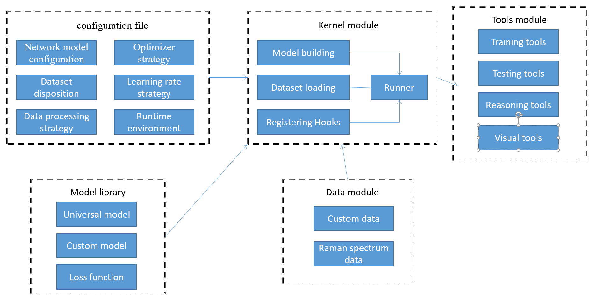
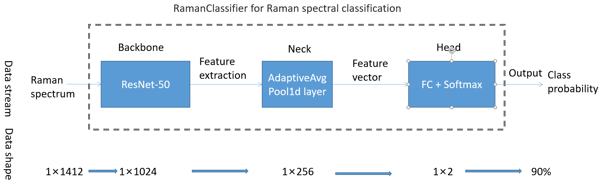
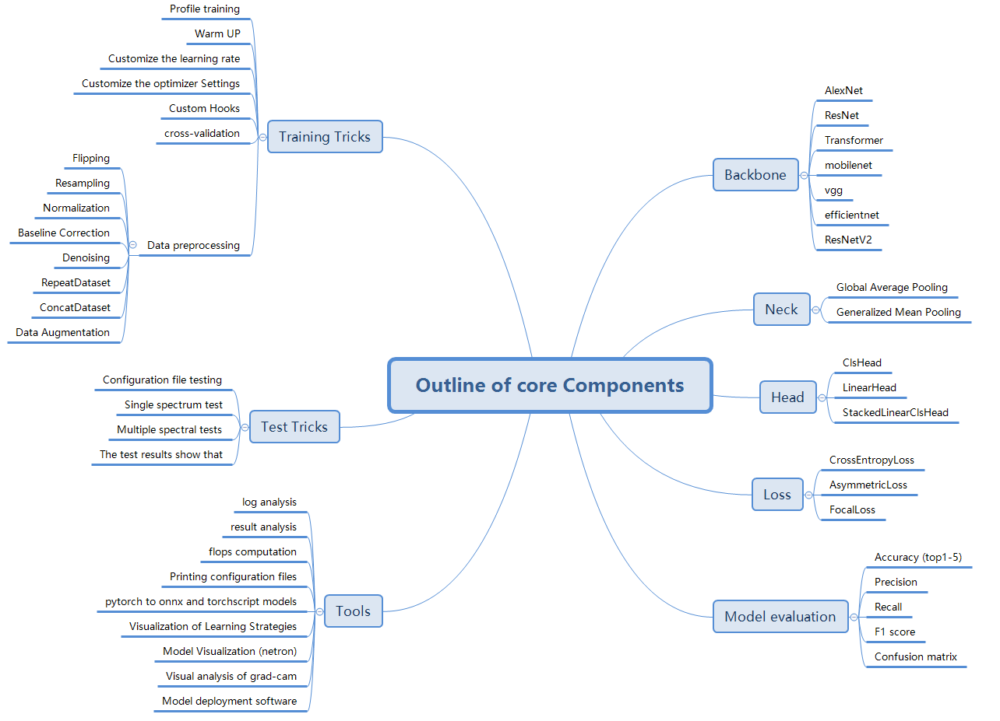

## Introduction

English | [简体中文](/README_zh-CN.md)

RSClassification is a PyTorch based open source deep learning framework for Raman spectroscopy, which can help users
quickly train Raman spectroscopy deep learning models.
This framework has been submitted for publication in the journal Talanta.
(in this framework reference OpenMMLab project [MMClassification (https://mmclassification.readthedocs.io/zh_CN/latest/)
project, more detailed tutorial can be found in them)

The approximate architecture is shown in the following figure:



Figure of Raman spectral classification model:



RSClassification core component diagram:



### Key Features

- Support for diverse backbones and pre-trained models
- Support multiple profiles
- High efficiency and scalability
- Support for custom network models and loss functions
- Network model and training loss visualization
- Log the training process and losses
- Supports grad-cam for visualizing one-dimensional network models

-Provide model deployment software examples

## Installation

Here are the brief steps for installation:

- Clone this repo:

```bash
git clone https://github.com/ISCLab-Bistu/RSClassification.git
cd RSClassification
```

- Create a conda virtual environment and activate it:

```bash
conda create -n RMSM python=3.10 -y
conda activate RMSM
```

- Install `CUDA==11.6` following
  the [official installation instructions](https://docs.nvidia.com/cuda/cuda-installation-guide-linux/index.html)
- Install `PyTorch==1.13` and `torchvision==0.14.0` with `CUDA==11.6`:

```bash
conda install pytorch torchvision torchaudio pytorch-cuda=11.6 -c pytorch -c nvidia
```

- Install dependent packages

```bash
pip install -r requirements.txt
```

## Data preprocessing

### Data preparation

We use the standard Raman spectroscopy data set, and all the data are unified in the data folder. You can also download
the corresponding data by yourself through the search website. The corresponding data set is shown in the following
figure:

|                    Dataset Name                    |                                                           Data Sources                                                           | Raman Shift |    Spectral Intensity     |                                         	Classification Type                                          |
|:--------------------------------------------------:|:--------------------------------------------------------------------------------------------------------------------------------:|:-----------:|:-------------------------:|:-----------------------------------------------------------------------------------------------------:|
|           Raman spectroscopy of Diabetes           |                              https://www.kaggle.com/datasets/codina/raman-spectroscopy-of-diabetes                               |   0-3000    |          -64-751          |                           2-classification (diabetes and healthy patients)                            |
|                Cells Raman Spectra                 |                                 https://www.kaggle.com/datasets/andriitrelin/cells-raman-spectra                                 |  100-4278   |         0-30.188          |                           2-classification (cancer cells and normal cells)                            |
|            Raman Microplastics Database            |                                         https://data.mendeley.com/datasets/kpygrf9fg6/2                                          |  200-3500   |         794-2762          |                    2-classification (standard samples and weathered microplastics)                    |
|                Raman spectra of GO                 |                                          https://data.mendeley.com/datasets/n4nts7hvvx                                           |  700-3500   |         1117-3117         |                    2-classification (distinguishing whether it is graphene oxide)                     |
|    Raman spectra of compressed milk flake sugar    |                                         https://data.mendeley.com/datasets/h52wy69bss/3                                          |  250-2339   |        -132-16432         | 2-classification (distinguishing compressed milk flake sugar with calcium and vitamin A, D additives) |
|                    pnas_dataset                    |                                https://figshare.com/articles/dataset/pnas_dataset_csv/19426739/1                                 |  600-1799   |        0-90（H1N1）         |                                           2-classification                                            |
|                   ovarian_cancer                   | https://figshare.com/articles/dataset/Raman_spectroscopic_techniques_to_detect_ovarian_cancer_biomarkers_in_blood_plasma/6744206 |  2002-401   |        7633-21776         |                           2-classification (distinguishing ovarian cancer)                            |                                              
|                    colibacillus                    |                                          https://zenodo.org/record/7109184#.ZBwuzMhfguU                                          |  508-1640   |        4537-10849         |                               2-classification (distinguishing E. coli)                               | 
|            COVID-19 Raman spectroscopy             |                                         https://doi.org/10.6084/m9.figshare.12159924.v1                                          |  400-2112   | -0.015-0.01(Preprocessed) |                           3-classification (confirmed, suspected, healthy)                            |
|        Second-order Raman spectra of LiNbO3        |                                          https://data.mendeley.com/datasets/zy57t3xrmg                                           |  1200-2100  |         1000-3839         |                    3-classification (different geometric shapes of Raman spectra)                     |
|                      LR-Raman                      |                                           https://rruff.info/zipped_data_files/raman/                                            |  175-6566   |        4434- 70710        |                               multi-classification (different minerals)                               |
|      Raman spectra of infant formula products      |                                          https://data.mendeley.com/datasets/4j8bj5vv52                                           |   50-3400   |         -200-4500         |                   multi-classification (classify multiple infant formula products)                    |
|           Raman spectra of single cells            |                                        https://databank.illinois.edu/datasets/IDB-9950442                                        |  600-1750   |         830-2210          |     multi-classification (distinguishing multiple hematopoietic stem cells and progenitor cells)      |
| Raman spectra of formic acid gasification products |                                         https://data.mendeley.com/datasets/hjn8xwskng/1                                          |  250-3256   |          -18-700          |          multi-classification (formic acid gasification products at different temperatures)           | 

For the standard Raman spectroscopy dataset, all the datasets are put into a csv. The file structure should look like
this:

```bash
  $ tree data
  data
  ├── word_dir(file name)
      ├── file_name.csv
 
```

The corresponding csv file format is shown in the following figure, which mainly includes four contents, which represent
the label, category, Raman frequency shift and Raman spectrum respectively
(The first row shows the Raman class, label, and subsequent variable type, respectively, and the second row shows the
corresponding Raman shift.)


### Data pipeline method

| Preprocessing Method |                                                                	Description                                                                |                       	Configuration File Example                        |                                               	Method Type                                               |
|:--------------------:|:------------------------------------------------------------------------------------------------------------------------------------------:|:------------------------------------------------------------------------:|:--------------------------------------------------------------------------------------------------------:|
|   LoadDataFromFile   | Load Raman Spectrum, where filepath and datasize represent the path of Raman spectrum and the proportion of data to be loaded respectively |      dict(type='LoadDataFromFile', file_path=None, data_size=None)       |                      1 type, no need to configure filepath and datasize by default                       |
|       ToTensor       |                                                       Convert labels to torch.Tensor                                                       |                  dict(type='ToTensor', keys=['labels'])                  |              1 type, different data processing can be achieved by specifying different keys              |
|  DataToFloatTensor   |                                                      Convert spectrum to torch.Tensor                                                      |            dict(type='DataToFloatTensor', keys=['spectrum'])             |              1 type, different data processing can be achieved by specifying different keys              |
|      Normalize       |                                                             Data normalization                                                             |                dict(type='Normalize', method='intensity')                | Three methods (corresponding to three different configurations of method): 'area', 'intensity', 'minmax' |
|    RemoveBaseline    |   Remove baseline, by providing roi (the range including the overall Raman shift), method, and some other parameters to fit the baseline   | dict(type='RemoveBaseline', roi=None, method='poly', polynomial_order=4) |                  10 different algorithms are available (detailed in the example below)                   |
|      Smoothing       |                                     Smooth the spectrum, by providing method and some other parameters                                     |          dict(type='Smooth', method="whittaker",Lambda=10**0.5)          |                  10 different algorithms are available (detailed in the example below)                   |
|       Flipping       |                                                            Flip the Raman shift                                                            |                           dict(type='FlipSpx')                           |                               1 type, flip the Raman shift of the spectrum                               |
|      Resampling      |                                                        Resample the Raman spectrum                                                         |              dict(type='Resampling', start=800, end=1800),               |                                 1 type, call the interpolation function                                  |
|    SpectrumToZero    |                                                  Set the negative spectral value to zero.                                                  |                       dict(type='SpectrumToZero')                        |                         1 type, remove the negative values of the Raman spectrum                         |
|  Data Augmentation   |                                                         Data augmentation methods                                                          |                      dict(type='AddNoise',num=200)                       |        3 types, methods for expanding Raman spectrum data: AddNoise, MoveRaman, IntensityFactory         |

Examples of 10 different configurations in RemoveBaseline:

    dict(type='RemoveBaseline', roi=[[400, 500], [750, 1000], [1400, 1500], [1500, 2500], [3000, 3200]], method='poly',polynomial_order=4)
    dict(type='RemoveBaseline', roi=[[400, 3200]], method='gcvspline',s=0.1)
    dict(type='RemoveBaseline', roi=[[400, 3200]], method='unispline', s=1e0)
    dict(type='RemoveBaseline', roi=[[400, 3200]], method='als', lam=10**5, p=0.05)
    dict(type='RemoveBaseline', roi=[[400, 3200]], method='arPLS', lam=10**6, ratio=0.001)
    dict(type='RemoveBaseline', roi=[[400, 3200]], method='drPLS')
    dict(type='RemoveBaseline', roi=[[400, 3200]], method='rubberband')
    dict(type='RemoveBaseline', roi=[[400, 3200]], method='gaussian', p0_gaussian=[1., 1., 1.])
    dict(type='RemoveBaseline', roi=[[400, 3200]], method='exp', p0_exp=[1., 1., 0.])
    dict(type='RemoveBaseline', roi=[[400, 3200]], method='log', p0_log=[1., 1., 1., 1.])

Examples of 10 different configurations in Smoothing:

    dict(type='Smoothing', method="GCVSmoothedNSpline")
    dict(type='Smoothing', method="DOFSmoothedNSpline")
    dict(type='Smoothing', method="MSESmoothedNSpline")
    dict(type='Smoothing', method="savgol",window_length=5,polyorder=2)
    dict(type='Smoothing', method="whittaker",Lambda=10**0.5)
    dict(type='Smoothing', method="flat",window_length=5)
    dict(type='Smoothing', method="hanning",window_length=5)
    dict(type='Smoothing', method="hamming",window_length=5)
    dict(type='Smoothing', method="bartlett",window_length=5)
    dict(type='Smoothing', method="blackman",window_length=5)

Example of three different configurations of Data Augmentation

    dict(type='AddNoise', num=200, noise_std=0.05)
    dict(type='MoveRaman', num=200, max_shift=5)
    dict(type='IntensityFactory', num=200)

## How do you write a configuration file

RSClassification mainly uses python files as configuration files. The design of its configuration file system integrates
modularity and inheritance, which facilitates users to conduct various experiments. All configuration files are placed
in
configs folder, mainly contains the _base_ original configuration folder resnet and other different dataset
configuration files. (For a more detailed configuration file tutorial, check out the MMClassification tutorial)

To see the full configuration information, you can use python tools/misc/print_config.py
configs/resnet/raman_Microplastics.py to easily inspect the corresponding configuration file.

The configs/_base_ folder is divided into three categories: datasets, models, schedules, and default_runtime.py

-datasets configuration file contains configuration information for each dataset. Here is an example of a configuration
file:

```commandline
# dataset settings
dataset_type = 'RamanSpectral'  # Dataset Name

# Train the data pipeline
train_pipeline = [
    dict(type='LoadDataFromFile'),
    # dict(type='Resampling', start=0, end=1840),
    # dict(type='Smoothing', method="savgol", window_length=5, polyorder=2),
    # dict(type='RemoveBaseline', roi=[[0, 2089]], method='als', lam=10 ** 5, p=0.05),
    dict(type='Normalize', method='minmax'),  # normalization
    dict(type='DataToFloatTensor', keys=['spectrum']),  # data to torch.Tensor
    dict(type='ToTensor', keys=['labels']),  # labels to torch.Tensor
]
# Test the data pipeline
test_pipeline = [
    dict(type='LoadDataFromFile'),
    # dict(type='Resampling', start=0, end=1840),
    # dict(type='Smoothing', method="savgol", window_length=5, polyorder=2),
    # dict(type='RemoveBaseline', roi=[[0, 2089]], method='als', lam=10 ** 5, p=0.05),
    dict(type='Normalize', method='minmax'),
    dict(type='DataToFloatTensor', keys=['spectrum']),
]

data = dict(
    samples_per_gpu=32,  # Batch size of a single GPU
    workers_per_gpu=2,  # Number of threads on a single GPU
    train=dict(
        type=dataset_type,
        data_size=(0, 0.7),
        file_path='data/cell_spectrum/results/cell_spectrum.csv',
        pipeline=train_pipeline,
    ),
    val=dict(
        type=dataset_type,
        data_size=(0.7, 0.9),
        file_path='data/cell_spectrum/results/cell_spectrum.csv',
        pipeline=test_pipeline,
        test_mode=True
    ),
    test=dict(
        type=dataset_type,
        data_size=(0.9, 1),
        file_path='data/cell_spectrum/results/cell_spectrum.csv',
        pipeline=test_pipeline,
        test_mode=True
    )
)

evaluation = dict(  # Accuracy Hook
    interval=1,
    metric='accuracy',
    metric_options={'topk': (1,)},
    save_best="auto",
    start=1
)


```

- Models contains the model configuration file, as shown in the following example:

```commandline
model = dict(
    type='RamanClassifier',  # Classifier types
    backbone=dict(
        type='ResNet', # Backbone network type
        depth=50,
        strides=(1, 1, 1, 1),
    ),
    neck=dict(type='GlobalAveragePooling'),
    head=dict(
        type='LinearClsHead',
        num_classes=5,
        in_channels=2048,
        loss=dict(type='CrossEntropyLoss', loss_weight=1.0),
        topk=(1,),
    ),
)
```

- Some examples of optimizers, strategies, and runners are set in schedules:

```commandline
optimizer = dict(type='SGD', lr=0.1, momentum=0.9, weight_decay=0.0001)
optimizer_config = dict(grad_clip=None)
# learning policy
lr_config = dict(
    policy='CosineAnnealing',
    min_lr=0,
    warmup='linear',
    warmup_iters=5,
    warmup_ratio=0.01,
    warmup_by_epoch=True)
runner = dict(type='EpochBasedRunner',  # Class of runner that will be used, such as IterBasedRunner or EpochBasedRunner.
              max_epochs=200)  # Total runner turns, using 'max_iters' for IterBasedRunner

```

- default_runtime.py contains the default runtime Settings, as shown in the following example:

```commandline
# Checkpoint hook configuration file.
checkpoint_config = dict(interval=1)  # The interval is 1, and the units vary depending on the runner, either epoch or iter.
# Log Configuration information
log_config = dict(
    interval=100,  # The interval in which the log is printed, in iters
    hooks=[
        dict(type='TextLoggerHook'),  # A logger for recording the training process.
        # dict(type='TensorboardLoggerHook')  # Tensorboard logging is also supported
    ])
launcher = 'pytorch'
log_level = 'INFO'  # The output level of the log
resume_from = None  # Restore checkpoints from a given path, and training mode will resume training from the saved rounds at the checkpoints
load_from = None
workflow = [('train', 2), ('val', 1)]  # runner's workflow
```

## Hook

Hook programming is a programming pattern, which is to set up a point (mount point) at one or more places in the
program. When the program runs to a point, all the methods registered at the point will be automatically called at
runtime. Hook programming can improve the flexibility and expansibility of the program. Users register their custom
methods in place and then they can be called without modifying the code in the program.

RSClassification provides a number of built-in hooks, which fall into two categories: default hooks, which are
registered with executors by default, and custom hooks, which require users to register themselves. (For a more detailed
Hook tutorial, refer to MMClassification or the pytorch Hook tutorial.)

### Default hook

|        name         |                       effect                       |  
|:-------------------:|:--------------------------------------------------:|
|    IterTimerHook    |          Records time for each iteration           |   
| DistSamplerSeedHook | 	Ensures the shuffle effect of distributed sampler |   
|     LoggerHook      |                Prints log messages                 | 
| ParamSchedulerHook  |      Calls the step method of ParamScheduler       |
|   CheckpointHook    |       	Saves weights at specified intervals        |    

### Custom hooks

|      name      |                   effect                    |  
|:--------------:|:-------------------------------------------:|
|    EvalHook    |              Evaluate the data              |   
| OptimizerHook  |      	Adjust optimizer strategies, etc      |   
| TextLoggerHook | Print logs (also supports Tensorboard logs) | 
| LrUpdaterHook  |     Configure learning rate adjustments     |
| CheckpointHook |    	Save weights at specified intervals     | 

### Hook Config

Some examples of partial Hook configuration are as follows:

```commandline
# learning policy
lr_config = dict(
    policy='CosineAnnealing',
    min_lr=0,
    warmup='linear',
    warmup_iters=5,
    warmup_ratio=0.01,
    warmup_by_epoch=True)
# Eval Hook
evaluation = dict(
    interval=1,
    metric='precision',
    metric_options={'topk': (1,)},
    save_best="auto",
    start=1
)
```

### Register Hook

In RSClassification, we only need to inherit the hook base class and implement the custom logic at specific sites
according to requirements, then register the hook in the Runner, and automatically call the method at the corresponding
site in the hook.

Hook is mainly registered in Runner. Custom hook is implemented by calling register_hook in runner. Here is an example
of registering Eval Hook.

```commandline
eval_hook = DistEvalHook if distributed else EvalHook
runner.register_hook(eval_hook(val_dataloader, **eval_cfg), priority='LOW')
```

Here is an example of some of the hooks printed while training

```commandline
before_run:
(VERY_HIGH   ) CosineAnnealingLrUpdaterHook       
(NORMAL      ) CheckpointHook                     
(LOW         ) EvalHook                           
(VERY_LOW    ) TextLoggerHook                     
 -------------------- 
before_train_epoch:
(VERY_HIGH   ) CosineAnnealingLrUpdaterHook       
(LOW         ) IterTimerHook                      
(LOW         ) EvalHook                           
(VERY_LOW    ) TextLoggerHook                     
 -------------------- 
before_train_iter:
(VERY_HIGH   ) CosineAnnealingLrUpdaterHook       
(LOW         ) IterTimerHook                      
(LOW         ) EvalHook                           
 -------------------- 
after_train_iter:
(ABOVE_NORMAL) OptimizerHook                      
(NORMAL      ) CheckpointHook                     
(LOW         ) IterTimerHook                      
(LOW         ) EvalHook                           
(VERY_LOW    ) TextLoggerHook                     
 -------------------- 
after_train_epoch:
(NORMAL      ) CheckpointHook                     
(LOW         ) EvalHook                           
(VERY_LOW    ) TextLoggerHook                     
 -------------------- 
before_val_epoch:
(LOW         ) IterTimerHook                      
(VERY_LOW    ) TextLoggerHook                     
 -------------------- 
before_val_iter:
(LOW         ) IterTimerHook                      
 -------------------- 
after_val_iter:
(LOW         ) IterTimerHook                      
 -------------------- 
after_val_epoch:
(VERY_LOW    ) TextLoggerHook                     
 -------------------- 
after_run:
(VERY_LOW    ) TextLoggerHook                     

```

## Train and Test

### Train

To train a model quickly, use tools/data/trian.py to train a model quickly:

Here's the full training script:
python tools/train.py ${CONFIG_FILE} [ARGS]

|      Parameter      |                                                                                     Description                                                                                      |
|:-------------------:|:------------------------------------------------------------------------------------------------------------------------------------------------------------------------------------:|
|     CONFIG_FILE     |                                                                         The path of the configuration file.                                                                          |
| --work-dir WORK_DIR |        	The directory used to save training logs and weight files. The default is the directory with the same name as the configuration file under the ./work_dirs directory.        |
|  --resume [RESUME]  | Resume training. If the path of the weight file is specified, the training will resume from the specified weight file. If not, the training will resume from the latest weight file. |
|    --no-validate    |                                      It is not recommended to skip validation during training for accuracy verification on the validation set.                                       |

### Test

快速测试模型，可以使用tools/data/test.py进行测试：

|      Parameter      |                                                                     Description                                                                      |
|:-------------------:|:----------------------------------------------------------------------------------------------------------------------------------------------------:|
|     CONFIG_FILE     |                                                         The path of the configuration file.                                                          |
|   CHECKPOINT_FILE   |                          The path to the weight file (supporting HTTP links). You can find the required weight files here.                           |
| --work-dir WORK_DIR | A folder used to save training logs and weight files. The default is the folder named after the configuration file under the ./work_dirs directory.	 |
|      --out OUT      |                                                     A file used to save the test metric results.                                                     |
|     -dump DUMP      |                                   A file used to save all model outputs, which can be used for offline evaluation.                                   |
| --show-dir SHOW_DIR |                                                 A folder used to save visualized prediction results.                                                 |

### cross validation

Use tools/data/kfold-cross-valid to do the cross-validation.The cross-validation process is similar to the training
process.You just need to perform k-fold classification on the data in BuildDataset.

|      Parameter      |                                                                  Description                                                                  |
|:-------------------:|:---------------------------------------------------------------------------------------------------------------------------------------------:|
|     CONFIG_FILE     |                                                        Path to the configuration file.                                                        |
|    --num-splits     |                                                     Number of folds for cross validation.                                                     |
| --work-dir WORK_DIR | Folder to save training logs and weight files. Default is a folder with the same name as the configuration file in the ./work_dirs directory. |
|  --resume [RESUME]  |              Resume training. If a weight file path is specified, resume from it. Otherwise, resume from the latest weight file.              |
|    --no-validate    |                                                   Do not validate accuracy during training.                                                   |
|      --summary      |                                                  Summarize k-fold cross validation results.                                                   |

## Model Library

The related models are all under rmsm/models, which mainly include backbones, neck, head, loss and classfiers

<details open>
<summary>Supported backbone network</summary>

- [x] [AlexNet](https://github.com/ISCLab-Bistu/RSClassification/rmsm/models/backbons/alexnet.py)
- [x] [ResNet](https://github.com/ISCLab-Bistu/RSClassification/rmsm/models/backbons/resnet.py)
- [x] [ResNetV2](https://github.com/ISCLab-Bistu/RSClassification/rmsm/models/backbons/resnet_v2.py)
- [x] [GoogLeNet](https://github.com/ISCLab-Bistu/RSClassification/rmsm/models/backbons/googlenet.py)
- [x] [EfficientNet](https://github.com/ISCLab-Bistu/RSClassification/rmsm/models/backbons/efficientnet.py)
- [x] [MobileNet](https://github.com/ISCLab-Bistu/RSClassification/rmsm/models/backbons/mobilenet.py)
- [x] [VGG](https://github.com/ISCLab-Bistu/RSClassification/rmsm/models/backbons/vgg.py)
- [x] [Transformer](https://github.com/ISCLab-Bistu/RSClassification/rmsm/models/backbons/transformer.py)

</details>

<details open>
<summary>Neck network of support</summary>

- [x] [Global Average Pooling](https://github.com/ISCLab-Bistu/RSClassification/rmsm/models/backbons/gap.py)
- [x] [Generalized Mean Pooling](https://github.com/ISCLab-Bistu/RSClassification/rmsm/models/backbons/gem.py)

</details>

<details open>
<summary>Supported classification headers</summary>

- [x] [ClsHead](https://github.com/ISCLab-Bistu/RSClassification/rmsm/models/backbons/cls_head.py)
- [x] [LinearHead](https://github.com/ISCLab-Bistu/RSClassification/rmsm/models/backbons/linear_head.py)

</details>

<details open>
<summary>Supported loss function</summary>

- [x] [CrossEntropyLoss](https://github.com/ISCLab-Bistu/RSClassification/rmsm/models/backbons/cross_entropy_loss.py)
- [x] [FocalLoss](https://github.com/ISCLab-Bistu/RSClassification/rmsm/models/backbons/focal_loss.py)
- [x] [AsymmetricLoss](https://github.com/ISCLab-Bistu/RSClassification/rmsm/models/backbons/asymmetric_loss.py)

</details>

## Tool Magazine

The tools package has a number of utility classes that you can use.

|        Tool name         |              Describe                |
|:-------------------:|:-------------------------------:|
|    analyze_logs     |  Log analysis, plot log curves  |
|   analyze_results   |         Result analysis         |
|      get_flops      |      Calculate model flops      |
|    print_config     | Print configuration information |
|   printconfusion    |     Print confusion matrix      |
|    pytorch2onnx     |     Convert Pytorch to ONNX     |
| pytorch2torchscript | Convert Pytorch to TorchScript  |
|       vis_lr        |  Visualize learning rate curve  |
|       vis_cam       | Visualize grad-cam of 1D model  |
|      vis_model      |         Visualize model         |

In addition to the above tools, this framework provides deployment model (currently ONNX model) software testing
example, located in the [RamanDeploy](/RamanDeploy/) Under a folder

## Acknowledgement

The code in this project is borrowed from [mmpretrain](https://github.com/open-mmlab/mmpretrain).

```BibTeX
@misc{2020mmclassification,
    title={OpenMMLab's Image Classification Toolbox and Benchmark},
    author={MMClassification Contributors},
    howpublished = {\url{https://github.com/open-mmlab/mmclassification}},
    year={2020}
}
```

