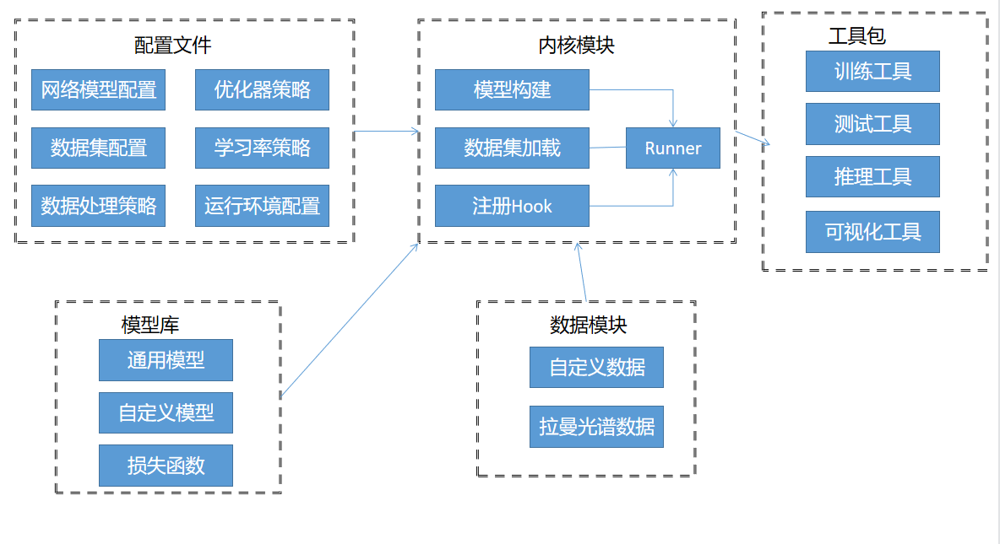
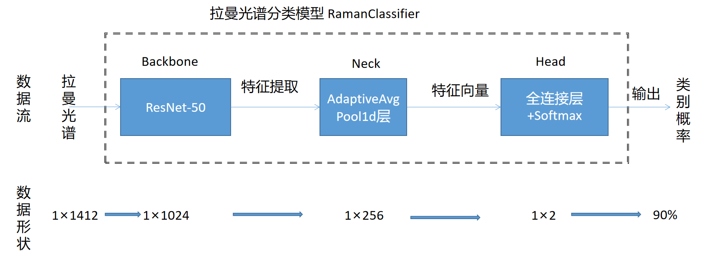
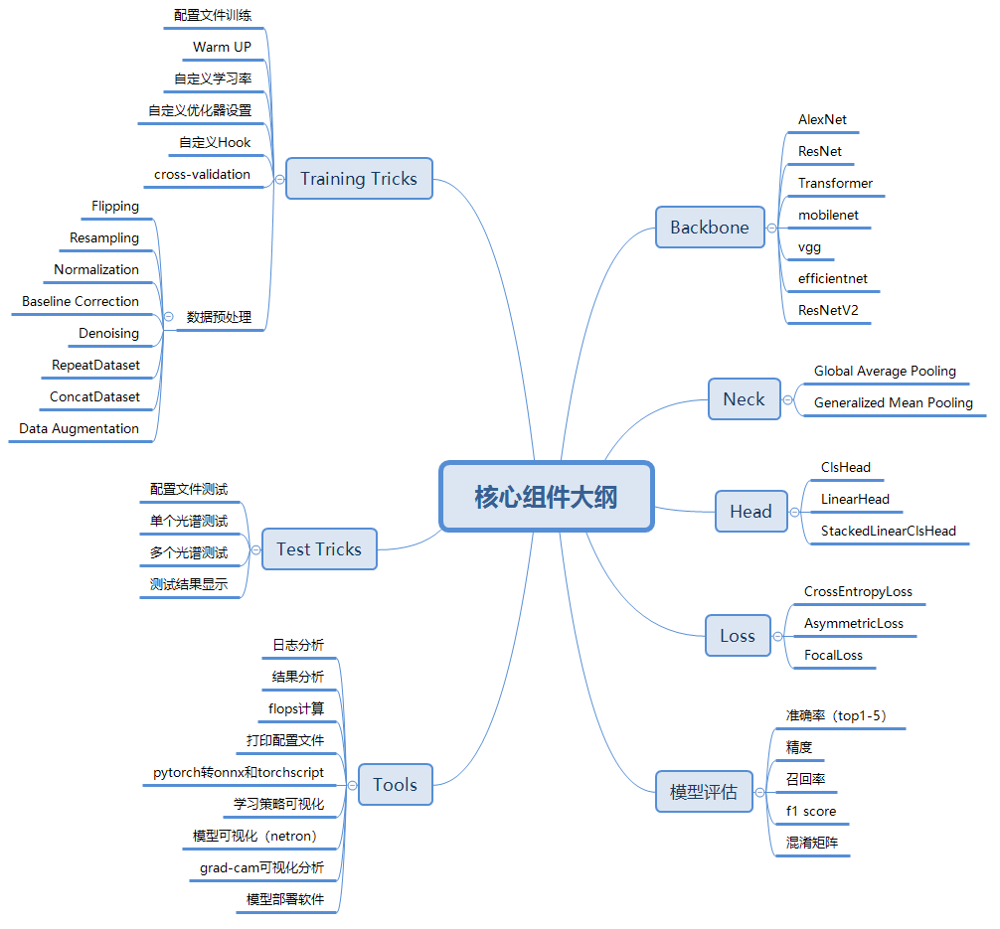
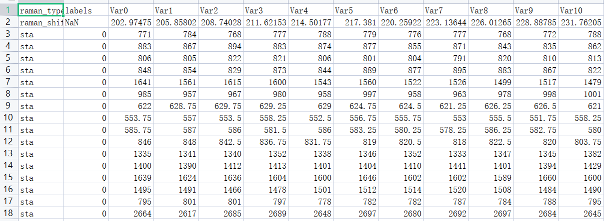

## Introduction

[English](/README.md) | 简体中文

RSClassification 是一款基于 PyTorch
的针对于拉曼光谱开源深度学习框架，其可以帮助用户快速进行拉曼光谱深度学习模型训练。本框架已经投稿至Talanta期刊中。（本框架参考了OpenMMLab项目中的[MMClassification](https://mmclassification.readthedocs.io/zh_CN/latest/)
项目，更加详细的教程可以在其中找到）

其大致的架构图如下图所示：



拉曼光谱分类模型图：



RSClassification核心组件图：




### 主要特性

- 支持多样的主干网络与预训练模型
- 支持多种配置文件
- 高效率和高可扩展性
- 支持自定义网络模型和损失函数
- 网络模型和训练损失可视化
- 日志记录训练过程和损失
- 支持grad-cam可视化一维网络模型
- 提供模型部署软件示例

## 安装

以下是安装的简要步骤：

- Clone this repo:

```bash
git clone https://github.com/ISCLab-Bistu/RSClassification.git
cd RSClassification
```

- Create a conda virtual environment and activate it:

```bash
conda create -n RMSM python=3.10 -y
conda activate RMSM
```

- Install `CUDA==11.6` following
  the [official installation instructions](https://docs.nvidia.com/cuda/cuda-installation-guide-linux/index.html)
- Install `PyTorch==1.13` and `torchvision==0.14.0` with `CUDA==11.6`:

```bash
conda install pytorch torchvision torchaudio pytorch-cuda=11.6 -c pytorch -c nvidia
```

- Install dependent packages

```bash
pip install -r requirements.txt
```

## Data preprocessing

### Data preparation

我们使用标准的拉曼光谱数据集，所有的数据都统一放在data文件夹下，你也可以通过搜索网址自行下载相应的数据，对应的数据集介绍如下图所示：

|              文件名               |                                                               数据网址                                                               |   拉曼频移    |        光谱强度        |               	分类               |
|:------------------------------:|:--------------------------------------------------------------------------------------------------------------------------------:|:---------:|:------------------:|:-------------------------------:|
|  COVID-19 Raman spectroscopy   |                                         https://doi.org/10.6084/m9.figshare.12159924.v1                                          | 400-2112  | -0.015-0.01（已经预处理） |          三分类（确诊，疑似，健康）          |
| Raman spectroscopy of Diabetes |                              https://www.kaggle.com/datasets/codina/raman-spectroscopy-of-diabetes                               |  0-3000   |      -64-751       |          二分类（糖尿病和健康患者）          |
|      Cells Raman Spectra       |                                 https://www.kaggle.com/datasets/andriitrelin/cells-raman-spectra                                 | 100-4278  |      0-30.188      |          二分类（癌细胞和正常细胞）          |
|            LR-Raman            |                                           https://rruff.info/zipped_data_files/raman/                                            | 175-6566  |    4434- 70710     |           多分类（不同矿物质）            |
|            拉曼微塑料数据库            |                                         https://data.mendeley.com/datasets/kpygrf9fg6/2                                          | 200-3500  |      794-2762      |         二分类（标准样品和风化微塑料）         |
|           氧化石墨烯的拉曼光谱           |                                          https://data.mendeley.com/datasets/n4nts7hvvx                                           | 700-3500  |     1117-3117      |         二分类（区分是否是氧化石墨烯）         |
|         婴幼儿配方奶粉产品的拉曼光谱         |                                          https://data.mendeley.com/datasets/4j8bj5vv52                                           |  50-3400  |     -200-4500      |         多分类（分类多个奶粉配方产品）         |
| Raman spectra of single cells  |                                        https://databank.illinois.edu/datasets/IDB-9950442                                        | 600-1750  |      830-2210      |       多分类（区分多个造血干细胞和祖细胞）        |
|         LiNbO3的二阶拉曼光谱          |                                          https://data.mendeley.com/datasets/zy57t3xrmg                                           | 1200-2100 |     1000-3839      |        三分类（不同几何形状的拉曼光谱）         |
|          甲酸气化产物的拉曼光谱           |                                         https://data.mendeley.com/datasets/hjn8xwskng/1                                          | 250-3256  |      -18-700       |        多分类（不同温度的甲酸气化产物）         |
|          压缩牛奶片糖的拉曼光谱           |                                         https://data.mendeley.com/datasets/h52wy69bss/3                                          | 250-2339  |     -132-16432     | 二分类（区分是否是含钙和维生素 A、D 添加剂的压缩牛奶片糖） |
|          pnas_dataset          |                                https://figshare.com/articles/dataset/pnas_dataset_csv/19426739/1                                 | 600-1799  |     0-90（H1N1）     |               二分类               |
|         ovarian_cancer         | https://figshare.com/articles/dataset/Raman_spectroscopic_techniques_to_detect_ovarian_cancer_biomarkers_in_blood_plasma/6744206 | 2002-401  |     7633-21776     |          二分类（区分患卵巢癌症）           |                                              
|          colibacillus          |                                          https://zenodo.org/record/7109184#.ZBwuzMhfguU                                          | 508-1640  |     4537-10849     |           二分类（区分大肠杆菌）           |                                              

对于标准的拉曼光谱数据集，将所有的数据集放入到一个csv当中。文件结构应该如下所示:

```bash
  $ tree data
  data
  ├── word_dir(file name)
      ├── file_name.csv
 
```

对应的csv文件格式如下图所示，主要包括四个内容，分别表示标签、类别、拉曼频移和拉曼光谱
（第一行分别表示拉曼类别、标签以及后面的变量类型，第二行为相应的拉曼频移）



### Data pipeline method

|      预处理方法名称      |                            描述                             |                                  配置文件示例                                  |                        方法种类                         |
|:-----------------:|:---------------------------------------------------------:|:------------------------------------------------------------------------:|:---------------------------------------------------:|
| LoadDataFromFile  | Load Raman Spectrum,其中file_path和data_size分别表示拉曼光谱路径和加载的比例 |      dict(type='LoadDataFromFile', file_path=None, data_size=None)       |            1种，默认无需配置file_path和data_size             |
|     ToTensor      |                   labels转为torch.Tensor                    |                  dict(type='ToTensor', keys=['labels'])                  |                1种，通过给定不同keys进行不同数据处理                |
| DataToFloatTensor |                  spectrum转为torch.Tensor                   |            dict(type='DataToFloatTensor', keys=['spectrum'])             |                 1种，给定不同keys进行不同数据处理                 |
|     Normalize     |                           数据归一化                           |                dict(type='Normalize', method='intensity')                | 三种方法（分别对应method三种不同的配置）：'area','intensity','minmax' |
|  RemoveBaseline   |       去基线操作，给定roi（包含拉曼频移整体的范围）、method以及一些其他参数来拟合基线,       | dict(type='RemoveBaseline', roi=None, method='poly', polynomial_order=4) |                 10种不同的算法可用（详细见下面示例）                 |
|     Smoothing     |      Smooth the spectrum, 通过给定method已经一些其他的参数来光滑拉曼光谱      |          dict(type='Smooth', method="whittaker",Lambda=10**0.5)          |                 10种不同的算法可用（详细见下面示例）                 |
|     Flipping      |                          翻转拉曼频移                           |                           dict(type='FlipSpx')                           |                    1种，翻转光谱的拉曼频移                     |
|    Resampling     |                          重采样拉曼光谱                          |              dict(type='Resampling', start=800, end=1800),               |                      1种，调用插值函数                      |
|  SpectrumToZero   |         Set the negative spectral value to zero.          |                       dict(type='SpectrumToZero')                        |                    1种，去除拉曼光谱的负值                     |
| Data Augmentation |                 Data augmentation methods                 |                      dict(type='AddNoise',num=200)                       | 3种，拉曼光谱数据扩容的方法，AddNoise 、MoveRaman、IntensityFactory |

RemoveBaseline中的10种不同的配置示例：

    dict(type='RemoveBaseline', roi=[[400, 500], [750, 1000], [1400, 1500], [1500, 2500], [3000, 3200]], method='poly',polynomial_order=4)
    dict(type='RemoveBaseline', roi=[[400, 3200]], method='gcvspline',s=0.1)
    dict(type='RemoveBaseline', roi=[[400, 3200]], method='unispline', s=1e0)
    dict(type='RemoveBaseline', roi=[[400, 3200]], method='als', lam=10**5, p=0.05)
    dict(type='RemoveBaseline', roi=[[400, 3200]], method='arPLS', lam=10**6, ratio=0.001)
    dict(type='RemoveBaseline', roi=[[400, 3200]], method='drPLS')
    dict(type='RemoveBaseline', roi=[[400, 3200]], method='rubberband')
    dict(type='RemoveBaseline', roi=[[400, 3200]], method='gaussian', p0_gaussian=[1., 1., 1.])
    dict(type='RemoveBaseline', roi=[[400, 3200]], method='exp', p0_exp=[1., 1., 0.])
    dict(type='RemoveBaseline', roi=[[400, 3200]], method='log', p0_log=[1., 1., 1., 1.])

Smoothing中的10种不同的配置示例：

    dict(type='Smoothing', method="GCVSmoothedNSpline")
    dict(type='Smoothing', method="DOFSmoothedNSpline")
    dict(type='Smoothing', method="MSESmoothedNSpline")
    dict(type='Smoothing', method="savgol",window_length=5,polyorder=2)
    dict(type='Smoothing', method="whittaker",Lambda=10**0.5)
    dict(type='Smoothing', method="flat",window_length=5)
    dict(type='Smoothing', method="hanning",window_length=5)
    dict(type='Smoothing', method="hamming",window_length=5)
    dict(type='Smoothing', method="bartlett",window_length=5)
    dict(type='Smoothing', method="blackman",window_length=5)

Data Augmentation的三种不同配置示例

    dict(type='AddNoise', num=200, noise_std=0.05)
    dict(type='MoveRaman', num=200, max_shift=5)
    dict(type='IntensityFactory', num=200)

## 如何编写配置文件

RSClassification 主要使用 python 文件作为配置文件。其配置文件系统的设计将模块化与继承整合进来，方便用户进行各种实验。所有配置文件都放置在
configs 文件夹下，主要包含 _base_ 原始配置文件夹resnet等不同数据集配置文件。(
更加详细的配置文件教程请查看MMClassification的教程)

可以使用 python tools/misc/print_config.py configs/resnet/raman_Microplastics.py 命令来查看完整的配置信息，从而方便检查所对应的配置文件。

其中configs/_base_文件夹下主要分为三类配置信息和默认的运行配置信息，分别是datasets、models、schedules以及default_runtime.py

- datasets配置文件中主要为相应的数据集配置信息，下列是其中一个配置文件示例：

```commandline
# dataset settings
dataset_type = 'RamanSpectral'  # 数据集名称

# 训练数据流水线
train_pipeline = [
    dict(type='LoadDataFromFile'),
    # dict(type='Resampling', start=0, end=1840),
    # dict(type='Smoothing', method="savgol", window_length=5, polyorder=2),
    # dict(type='RemoveBaseline', roi=[[0, 2089]], method='als', lam=10 ** 5, p=0.05),
    dict(type='Normalize', method='minmax'),  # 归一化
    dict(type='DataToFloatTensor', keys=['spectrum']),  # data 转为 torch.Tensor
    dict(type='ToTensor', keys=['labels']),  # labels 转为 torch.Tensor
    # dict(type='Collect', keys=['data', 'labels'])  # 决定数据中哪些键应该传递给检测器的流程
]
# 测试数据流水线
test_pipeline = [
    dict(type='LoadDataFromFile'),
    # dict(type='Resampling', start=0, end=1840),
    # dict(type='Smoothing', method="savgol", window_length=5, polyorder=2),
    # dict(type='RemoveBaseline', roi=[[0, 2089]], method='als', lam=10 ** 5, p=0.05),
    dict(type='Normalize', method='minmax'),
    dict(type='DataToFloatTensor', keys=['spectrum']),
]

data = dict(
    samples_per_gpu=32,  # 单个 GPU 的 Batch size
    workers_per_gpu=2,  # 单个 GPU 的 线程数
    train=dict(
        type=dataset_type,
        data_size=(0, 0.7),
        file_path='data/cell_spectrum/results/cell_spectrum.csv',
        pipeline=train_pipeline,
    ),
    val=dict(
        type=dataset_type,
        data_size=(0.7, 0.9),
        file_path='data/cell_spectrum/results/cell_spectrum.csv',
        pipeline=test_pipeline,
        test_mode=True
    ),
    test=dict(
        type=dataset_type,
        data_size=(0.9, 1),
        file_path='data/cell_spectrum/results/cell_spectrum.csv',
        pipeline=test_pipeline,
        test_mode=True
    )
)

evaluation = dict(  # 计算准确率
    interval=1,
    metric='accuracy',
    metric_options={'topk': (1,)},
    save_best="auto",
    start=1
)


```

- models中为模型配置文件，示例如下：

```commandline
model = dict(
    type='RamanClassifier',  # 分类器类型
    backbone=dict(
        # type='ResNetV2',  # 主干网络类型
        type='ResNet',
        depth=50,
        strides=(1, 1, 1, 1),
    ),
    neck=dict(type='GlobalAveragePooling'),
    head=dict(
        type='LinearClsHead',
        num_classes=5,
        in_channels=2048,
        loss=dict(type='CrossEntropyLoss', loss_weight=1.0),
        topk=(1,),
    ),
)
```

- schedules中为一些优化器、优化策略以及运行器设置，示例如下：

```commandline
optimizer = dict(type='SGD', lr=0.1, momentum=0.9, weight_decay=0.0001)
optimizer_config = dict(grad_clip=None)
# learning policy
lr_config = dict(
    policy='CosineAnnealing',
    min_lr=0,
    warmup='linear',
    warmup_iters=5,
    warmup_ratio=0.01,
    warmup_by_epoch=True)
runner = dict(type='EpochBasedRunner',  # 将使用的 runner 的类别，如 IterBasedRunner 或 EpochBasedRunner。
              max_epochs=200)  # runner 总回合数， 对于 IterBasedRunner 使用 `max_iters`

```

- default_runtime.py中为默认的运行设置，示例如下：

```commandline
# Checkpoint hook 的配置文件。
checkpoint_config = dict(interval=1)  # 保存的间隔是 1，单位会根据 runner 不同变动，可以为 epoch 或者 iter。
# 日志配置信息。
log_config = dict(
    interval=100,  # 打印日志的间隔， 单位 iters
    hooks=[
        dict(type='TextLoggerHook'),  # 用于记录训练过程的文本记录器(logger)。
        # dict(type='TensorboardLoggerHook')  # 同样支持 Tensorboard 日志
    ])
launcher = 'pytorch'
log_level = 'INFO'  # 日志的输出级别。
resume_from = None  # 从给定路径里恢复检查点(checkpoints)，训练模式将从检查点保存的轮次开始恢复训练。
load_from = None
workflow = [('train', 2), ('val', 1)]  # runner 的工作流程
```

## Hook

钩子编程是一种编程模式，是指在程序的一个或者多个位置设置位点（挂载点），当程序运行至某个位点时，会自动调用运行时注册到位点的所有方法。钩子编程可以提高程序的灵活性和拓展性，用户将自定义的方法注册到位点便可被调用而无需修改程序中的代码。

RSClassification提供了许多内置的钩子，钩子分为两类，分别是默认钩子以及自定义钩子，前者表示会默认往执行器注册，后者表示需要用户自己注册。（更加详细的Hook教程可以参考MMClassification或者pytorch中的Hook教程）

### 默认钩子

|         名称          |             用途              |  
|:-------------------:|:---------------------------:|
|    IterTimerHook    |           统计迭代耗时            |   
| DistSamplerSeedHook | 	确保分布式 Sampler 的 shuffle 生效 |   
|     LoggerHook      |            打印日志             | 
| ParamSchedulerHook  | 调用 ParamScheduler 的 step 方法 |
|   CheckpointHook    |         	按指定间隔保存权重          |    

### 自定义钩子

|       名称       |            用途             |  
|:--------------:|:-------------------------:|
|    EvalHook    |          对数据进行评估          |   
| OptimizerHook  |         	调整优化器策略等         |   
| TextLoggerHook | 打印日志（同样支持 Tensorboard 日志） | 
| LrUpdaterHook  |          学习率调整配置          |
| CheckpointHook |        	按指定间隔保存权重         | 

### Hook Config

部分Hook配置的一些示例如下：

```commandline
# learning policy(用于注册 LrUpdater hook。)
lr_config = dict(
    policy='CosineAnnealing',
    min_lr=0,
    warmup='linear',
    warmup_iters=5,
    warmup_ratio=0.01,
    warmup_by_epoch=True)
# Eval Hook配置
evaluation = dict(  # 计算准确率
    interval=1,
    metric='precision',
    metric_options={'topk': (1,)},
    save_best="auto",
    start=1
)
```

### Register Hook

在RSClassification中只需继承钩子基类并根据需求在特定位点实现定制化逻辑，再将钩子注册到执行器（Runner）中，便可自动调用钩子中相应位点的方法。
钩子主要是在执行器（Runner）中进行注册，自定义的钩子通过调用执行器中的register_hook来实现，下面是注册一个Eval Hook的示例。

```commandline
eval_hook = DistEvalHook if distributed else EvalHook
runner.register_hook(eval_hook(val_dataloader, **eval_cfg), priority='LOW')
```

下面是进行训练时，打印的部分钩子示例

```commandline
before_run:
(VERY_HIGH   ) CosineAnnealingLrUpdaterHook       
(NORMAL      ) CheckpointHook                     
(LOW         ) EvalHook                           
(VERY_LOW    ) TextLoggerHook                     
 -------------------- 
before_train_epoch:
(VERY_HIGH   ) CosineAnnealingLrUpdaterHook       
(LOW         ) IterTimerHook                      
(LOW         ) EvalHook                           
(VERY_LOW    ) TextLoggerHook                     
 -------------------- 
before_train_iter:
(VERY_HIGH   ) CosineAnnealingLrUpdaterHook       
(LOW         ) IterTimerHook                      
(LOW         ) EvalHook                           
 -------------------- 
after_train_iter:
(ABOVE_NORMAL) OptimizerHook                      
(NORMAL      ) CheckpointHook                     
(LOW         ) IterTimerHook                      
(LOW         ) EvalHook                           
(VERY_LOW    ) TextLoggerHook                     
 -------------------- 
after_train_epoch:
(NORMAL      ) CheckpointHook                     
(LOW         ) EvalHook                           
(VERY_LOW    ) TextLoggerHook                     
 -------------------- 
before_val_epoch:
(LOW         ) IterTimerHook                      
(VERY_LOW    ) TextLoggerHook                     
 -------------------- 
before_val_iter:
(LOW         ) IterTimerHook                      
 -------------------- 
after_val_iter:
(LOW         ) IterTimerHook                      
 -------------------- 
after_val_epoch:
(VERY_LOW    ) TextLoggerHook                     
 -------------------- 
after_run:
(VERY_LOW    ) TextLoggerHook                     

```

## Train and Test

### Train

快速的训练模型，可以使用tools/data/trian.py快速训练一个模型：

以下是训练脚本的完整写法：
python tools/train.py ${CONFIG_FILE} [ARGS]

|         参数          |                          描述                          |
|:-------------------:|:----------------------------------------------------:|
|     CONFIG_FILE     |                       配置文件的路径。                       |
| --work-dir WORK_DIR | 	用来保存训练日志和权重文件的文件夹，默认是 ./work_dirs 目录下，与配置文件同名的文件夹。  |
|  --resume [RESUME]  | 恢复训练。如果指定了权重文件路径，则从指定的权重文件恢复；如果没有指定，则尝试从最新的权重文件进行恢复。 |
|    --no-validate    |               不建议 在训练过程中不进行验证集上的精度验证。                |

### Test

快速测试模型，可以使用tools/data/test.py进行测试：

|         参数          |                         描述                          |
|:-------------------:|:---------------------------------------------------:|
|     CONFIG_FILE     |                      配置文件的路径。                       |
|   CHECKPOINT_FILE   |         权重文件路径（支持 http 链接，你可以在这里寻找需要的权重文件）。         |
| --work-dir WORK_DIR | 	用来保存训练日志和权重文件的文件夹，默认是 ./work_dirs 目录下，与配置文件同名的文件夹。 |
|      --out OUT      |                   用来保存测试指标结果的文件。                    |
|     -dump DUMP      |             用来保存所有模型输出的文件，这些数据可以用于离线测评。             |
| --show-dir SHOW_DIR |                  用于保存可视化预测结果的文件夹。                   |

### cross validation

使用tools/data/kfold-cross-valid来进行交叉校验，交叉验证操作流程和训练流程类似，只需要在BuildDataset中对数据进行K折分类即可。

|         参数          |                          描述                          |
|:-------------------:|:----------------------------------------------------:|
|     CONFIG_FILE     |                       配置文件的路径。                       |
|    --num-splits     |                        几折交叉验证                        |
| --work-dir WORK_DIR |  用来保存训练日志和权重文件的文件夹，默认是 ./work_dirs 目录下，与配置文件同名的文件夹。  |
|  --resume [RESUME]  | 恢复训练。如果指定了权重文件路径，则从指定的权重文件恢复；如果没有指定，则尝试从最新的权重文件进行恢复。 |
|    --no-validate    |               不建议 在训练过程中不进行验证集上的精度验证。                |
|      --summary      |                   总结k-fold交叉验证结果。                    |

## 模型库

相关的模型均在rmsm/models下，其中主要包括backbones、neck、head、loss和classfiers

<details open>
<summary>支持的主干网络</summary>

- [x] [AlexNet](https://github.com/ISCLab-Bistu/RSClassification/rmsm/models/backbons/alexnet.py)
- [x] [ResNet](https://github.com/ISCLab-Bistu/RSClassification/rmsm/models/backbons/resnet.py)
- [x] [ResNetV2](https://github.com/ISCLab-Bistu/RSClassification/rmsm/models/backbons/resnet_v2.py)
- [x] [EfficientNet](https://github.com/ISCLab-Bistu/RSClassification/rmsm/models/backbons/efficientnet.py)
- [x] [MobileNet](https://github.com/ISCLab-Bistu/RSClassification/rmsm/models/backbons/mobilenet.py)
- [x] [VGG](https://github.com/ISCLab-Bistu/RSClassification/rmsm/models/backbons/vgg.py)
- [x] [Transformer](https://github.com/ISCLab-Bistu/RSClassification/rmsm/models/backbons/transformer.py)

</details>

<details open>
<summary>支持的颈网络</summary>

- [x] [Global Average Pooling](https://github.com/ISCLab-Bistu/RSClassification/rmsm/models/backbons/gap.py)
- [x] [Generalized Mean Pooling](https://github.com/ISCLab-Bistu/RSClassification/rmsm/models/backbons/gem.py)

</details>

<details open>
<summary>支持的分类头</summary>

- [x] [ClsHead](https://github.com/ISCLab-Bistu/RSClassification/rmsm/models/backbons/cls_head.py)
- [x] [LinearHead](https://github.com/ISCLab-Bistu/RSClassification/rmsm/models/backbons/linear_head.py)

</details>

<details open>
<summary>支持的损失函数</summary>

- [x] [CrossEntropyLoss](https://github.com/ISCLab-Bistu/RSClassification/rmsm/models/backbons/cross_entropy_loss.py)
- [x] [FocalLoss](https://github.com/ISCLab-Bistu/RSClassification/rmsm/models/backbons/focal_loss.py)
- [x] [AsymmetricLoss](https://github.com/ISCLab-Bistu/RSClassification/rmsm/models/backbons/asymmetric_loss.py)

</details>

## 工具库
tools包下有许多工具类，可以使用。

|        工具名称         |         描述          |
|:-------------------:|:-------------------:|
|    analyze_logs     |    日志分析，绘制日志曲线图     |
|   analyze_results   |        结果分析         |
|      get_flops      |     计算模型的flops      |
|    print_config     |      打印配置文件信息       |
|   printconfusion    |       打印混淆矩阵        |
|    pytorch2onnx     |    Pytorch转ONNX     |
| pytorch2torchscript | Pytorch转TorchScript |
|       vis_lr        |      可视化学习率曲线       |
|       vis_cam       |   grad-cam可视化一维模型   |
|      vis_model      |        模型可视化        |

除了以上工具，本框架还提供了模型部署（目前是ONNX模型）软件测试示例，位于[RamanDeploy](https://github.com/ISCLab-Bistu/RSClassification/tree/master/RamanDeploy) 文件夹下

## Acknowledgement
本项目中的代码借鉴了[mmpretrain](https://github.com/open-mmlab/mmpretrain)

```BibTeX
@misc{2020mmclassification,
    title={OpenMMLab's Image Classification Toolbox and Benchmark},
    author={MMClassification Contributors},
    howpublished = {\url{https://github.com/open-mmlab/mmclassification}},
    year={2020}
}
```

